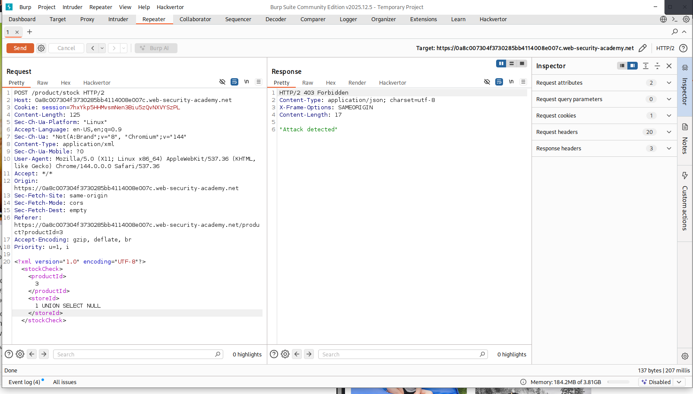
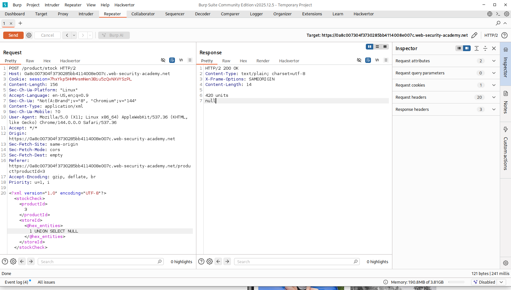
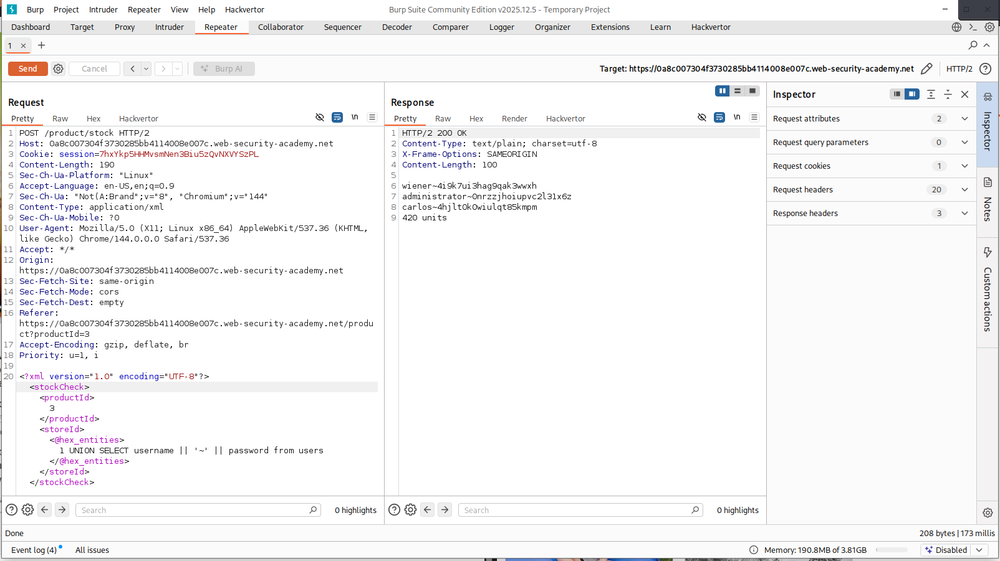

Challenge : Obsfucate sql into the website to get admin credentials.
tried basic sql - 'OR 1=1--
No success.

Turned to manual testing - using burp
Portswigger was so clear ,the sql vulnerability is in stock. --- /product/stock
sent to repeater.
So I checked the stock Item,tried basic union sql .no success.

Then shifted to hackvertor.
right click - extensions - hackvertor - encode - hex-strings
tested first.

Then now did the real sql union.----- UNION SELECT username || '~' || password from users. #BOOM ,,It worked

